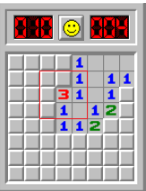
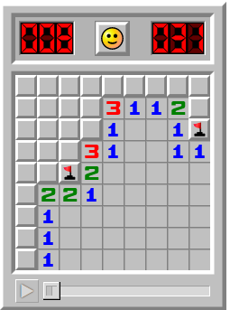
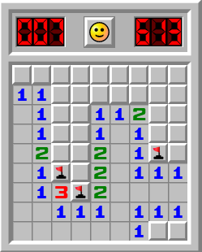
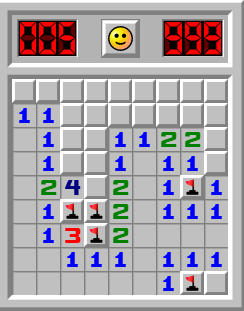

# Test 1:


```
{-2, -2, -2, -2,  1,  0,  0,  0},
{-2, -2, -2, -2,  1,  0,  1,  1},
{-2, -2, -2,  3,  1,  0,  1, -2},
{-2, -2, -2,  1,  0,  1,  2, -2},
{-2, -2, -2,  1,  1,  2, -2, -2},
{-2, -2, -2, -2, -2, -2, -2, -2},
{-2, -2, -2, -2, -2, -2, -2, -2},
{-2, -2, -2, -2, -2, -2, -2, -2}
```

### Output: 
```
panels that will be flagged:
(3, 1)
(7, 2)
(6, 4)
panels that will be revealed:
```


 # Test 2:


```
{-2, -2, -2, -2, -2, -2, -2, -2, -2},
{-2, -2, -2, -2,  3,  1,  1,  2, -2},
{-2, -2, -2, -2,  1,  0,  0,  1, -1},
{-2, -2, -2,  3,  1,  0,  0,  1,  1},
{-2, -2, -1,  2,  0,  0,  0,  0,  0},
{-2,  2,  2,  1,  0,  0,  0,  0,  0},
{-2,  1,  0,  0,  0,  0,  0,  0,  0},
{-2,  1,  0,  0,  0,  0,  0,  0,  0},
{-2,  1,  0,  0,  0,  0,  0,  0,  0}
```

### Output:
```
panels that will be flagged:
(3, 2)
(2, 3)
(1, 4)
panels that will be revealed:
(8, 1)
```


# Test 3:

```
{-2, -2, -2, -2, -2, -2, -2, -2, -2},
{ 1,  1, -2, -2, -2, -2, -2, -2, -2},
{ 0,  1, -2, -2,  1,  1,  2, -2, -2},
{ 0,  1, -2, -2,  1,  0,  1, -2, -2},
{ 0,  2, -2, -2,  2,  0,  1, -1, -2},
{ 0,  1, -1, -2,  2,  0,  1,  1,  1},
{ 0,  1,  3, -1,  2,  0,  0,  0,  0},
{ 0,  0,  1,  1,  1,  0,  1,  1,  1},
{ 0,  0,  0,  0,  0,  0,  1, -2, -2}
```

### Output:
```
panels that will be flagged:
(3, 5)
(7, 8)
panels that will be revealed:
(7, 2)
(7, 3)
(2, 4)
(8, 4)
```

## test 3 continue:

```
{-2, -2, -2, -2, -2, -2, -2, -2, -2},
{ 1,  1, -2, -2, -2, -2, -2, -2, -2},
{ 0,  1, -2, -2,  1,  1,  2,  2, -2},
{ 0,  1, -2, -2,  1,  0,  1,  1, -2},
{ 0,  2,  4, -2,  2,  0,  1, -1,  1},
{ 0,  1, -1, -1,  2,  0,  1,  1,  1},
{ 0,  1,  3, -1,  2,  0,  0,  0,  0},
{ 0,  0,  1,  1,  1,  0,  1,  1,  1},
{ 0,  0,  0,  0,  0,  0,  1, -1, -2}
```

### Output:
```
panels that will be flagged:
(2, 3)
panels that will be revealed:
(8, 2)
(8, 3)
(3, 4)
(8, 8)
```